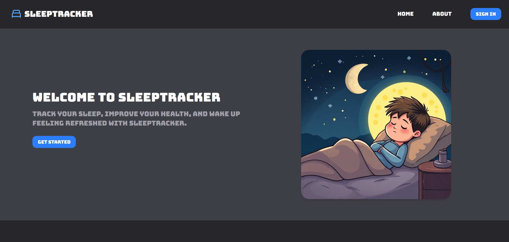
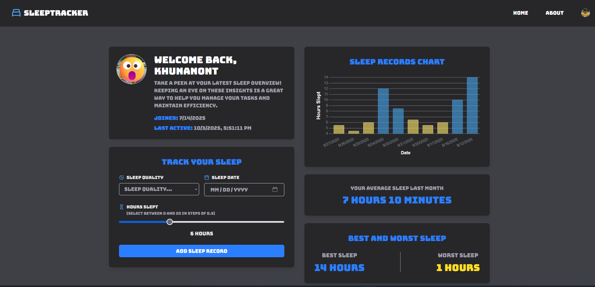
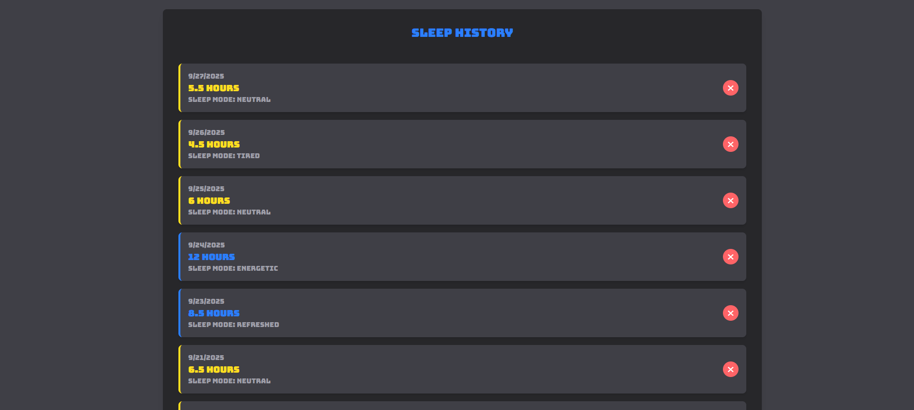
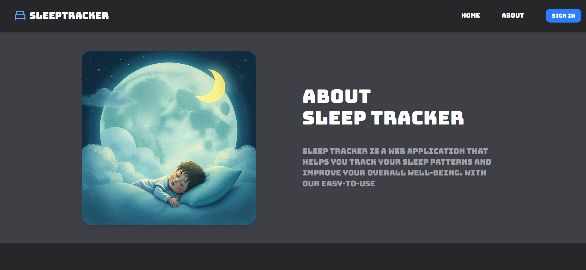

# Sleep Tracking App

Track your daily sleep hours + mood, visualize patterns, and understand your rest over time.

[Live Demo → sleep-tracker-pearl.vercel.app](https://sleep-tracker-pearl.vercel.app)  

---

## 🧠 What It Does

- Log how many hours you slept each day  
- Rate how you feel about your sleep (mood, restfulness, etc.)  
- View your average sleep hours over a month  
- See which days you slept the most / least  
- Graphical visualization of sleep data  
- Editable record list — delete entries if needed  

---

## 🛠️ Tech Stack

| Layer | Technology |
|-------|------------|
| Framework / UI | Next.js + React + TypeScript |
| Database | Prisma + PostgreSQL (Neon) |
| Authentication | Clerk |
| Styling / Other | Tailwind |

---

## 📁 Project Structure

```
Sleep-Tracking-App/
├─ app/
├─ components/
├─ lib/
├─ prisma/
├─ public/
├─ type/
├─ middleware.ts
├─ next.config.ts
├─ tsconfig.json
├─ package.json
├─ postcss.config.mjs
├─ eslint.config.mjs
└─ .gitignore
```

---

# Website Image





